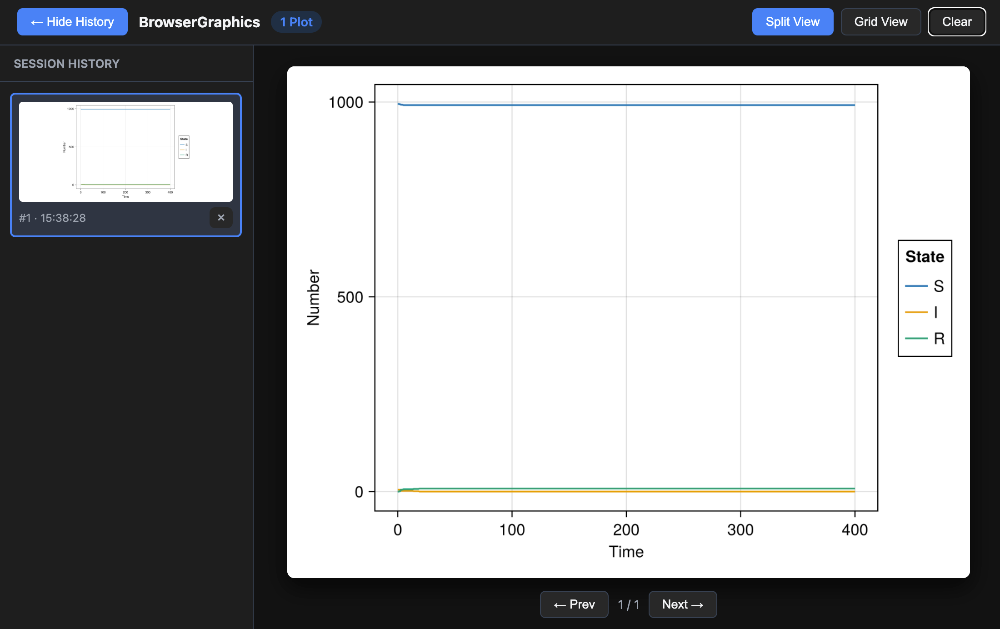

# BrowserPlots.jl

BrowserPlots.jl sends plots from a Julia session to a lightweight gallery in your web browser. It integrates with Julia's display system, keeps a session history, and works with both [Plots.jl](https://docs.juliaplots.org/) and [Makie](https://docs.makie.org/).



## Installation

Install BrowserPlots directly from GitHub:

```julia
import Pkg
Pkg.add(url = "https://github.com/arnold-c/BrowserPlots.jl")
```

Install a plotting package separately if you do not already have one:

```julia
Pkg.add("CairoMakie")
# or
Pkg.add("Plots")
```

## Quick start

### Plots.jl

```julia
using BrowserPlots
using Plots

browse()
plot(1:10, (1:10) .^ 2; label = "x²", xlabel = "x", ylabel = "y")
scatter!(1:10, 10 .* rand(10); label = "samples")
```

### Makie

Use a Makie backend capable of producing PNG output, such as CairoMakie:

```julia
using BrowserPlots
using CairoMakie

browse()
x = range(0, 2π; length = 200)
lines(x, sin.(x); axis = (; title = "Sine wave"))
```

`browse()` starts a local server, registers the browser gallery with Julia's display stack, and opens the gallery in a new tab. In an interactive session, plots displayed by Julia are added automatically. In a script—or whenever output is suppressed—call `display` explicitly:

```julia
p = plot(rand(20))
display(p)
```

> **Tip:** Start `browse()` before creating plots that you want to retain in the gallery.

## Using the gallery

The gallery updates as plots are generated. It provides:

- a focused split view with session-history thumbnails;
- a grid view for comparing plots;
- previous and next navigation, including the arrow keys;
- controls to delete individual plots or clear the full history.

The server listens only on `127.0.0.1`, so the gallery is available to the local machine at `http://127.0.0.1:8008` by default.

## Server and history control

Choose another port or prevent BrowserPlots from opening a tab:

```julia
browse(port = 8080)
browse(silent = true)
```

Calling `browse()` while the server is running restarts it. Use `silent = true` to restart without opening another tab, then reload an existing gallery tab:

```julia
browse(silent = true)
```

History can be managed from Julia as well as from the gallery:

```julia
clear_history!()  # remove every plot from the current history
close_server!()   # stop the server and unregister the display
```

`close_server!()` preserves the in-memory history. Calling `browse()` again makes that history available in the new server session. Use `clear_history!()` when you want to remove it.

> **Warning:** A plot expression ending in `;` is not displayed automatically. Remove the semicolon or pass the plot to `display`.

## API

### `browse`

```julia
browse(; port = 8008, silent = false)
```

Start or restart the browser gallery server and register BrowserPlots with Julia's display stack.

### `clear_history!`

```julia
clear_history!()
```

Remove all plots stored in the browser gallery's in-memory session history.

### `close_server!`

```julia
close_server!()
```

Stop the HTTP server and remove BrowserPlots from Julia's display stack. This does not clear the session history.
